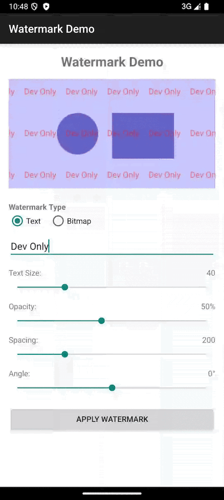

# Watermark Library

A simple and customizable watermark library for Android applications. This library allows you to add text or bitmap watermarks to your activities or views.

## Features

- Add text watermarks with customizable text, color, size, spacing, and angle
- Add bitmap watermarks with customizable alpha, spacing, and angle
- Easy integration with any Android application
- Convenient helper methods for common use cases
- Support for debug watermarks

## Installation

### Gradle
You can use the library in one of the following ways:

#### Option 1: Download the AAR File
1. Download the AAR file from the [android-watermark.aar](doc/android-watermark.aar) section of this repository.
2. Add the AAR file to your project:
    - Place the `.aar` file in the `libs` folder of your project.
    - Update your `build.gradle` file to include the following:

      ```gradle
      repositories {
          flatDir {
              dirs 'libs'
          }
      }
 
      dependencies {
          implementation(name: 'android-watermark', ext: 'aar')
      }
      ```


#### Option 2: Use Maven Repository
Add the following to your project's build.gradle file:
```gradle
// project level gradle
repositories {
    mavenCentral()
    // or
    maven { url 'https://jitpack.io' }
}

// module level gradle
dependencies {
    implementation 'com.musarayy:watermark:1.0.0'
}
```

## Usage

### Adding a Debug Watermark

To add a "Dev Only" watermark to your activity (useful for debug builds):

```kotlin
// In your activity
if (BuildConfig.DEBUG) {
    WatermarkManager.addDebugWatermark(this)
}
```

### Adding a Text Watermark

```kotlin
// Basic usage with default settings
val watermarkView = WatermarkManager.addTextWatermark(
    activity = this,
    text = "CONFIDENTIAL"
)

// Advanced usage with custom settings
val watermarkView = WatermarkManager.addTextWatermark(
    activity = this,
    text = "DRAFT",
    textColor = Color.argb(70, 0, 0, 255), // Semi-transparent blue
    textSize = 60f,
    spacing = 300,
    angle = -30f
)
```

### Adding a Bitmap Watermark

```kotlin
// Load your bitmap
val bitmap = BitmapFactory.decodeResource(resources, R.drawable.logo)

// Basic usage with default settings
val watermarkView = WatermarkManager.addBitmapWatermark(
    activity = this,
    bitmap = bitmap
)

// Advanced usage with custom settings
val watermarkView = WatermarkManager.addBitmapWatermark(
    activity = this,
    bitmap = bitmap,
    alpha = 80,
    spacing = 400,
    angle = 0f // No rotation
)
```

### Adding Watermarks to Views

You can also add watermarks to specific views instead of the entire activity:

```kotlin
// Add a text watermark to a specific view
val watermarkView = WatermarkManager.addTextWatermark(
    view = myImageView,
    text = "SAMPLE"
)

// Add a bitmap watermark to a specific view
val watermarkView = WatermarkManager.addBitmapWatermark(
    view = myImageView,
    bitmap = logoBitmap
)
```

### Using the WatermarkView Directly

For more control, you can use the WatermarkView class directly:

```kotlin
val watermarkView = WatermarkView(context).apply {
    text = "CUSTOM WATERMARK"
    textColor = Color.argb(60, 255, 0, 0)
    textSize = 50f
    spacing = 250
    angle = -45f
}

// Add it to your layout
myLayout.addView(watermarkView)
```


## Demo Output



## License

```
MIT License

Copyright (c) 2025 Musarayy

Permission is hereby granted, free of charge, to any person obtaining a copy
of this software and associated documentation files (the "Software"), to deal
in the Software without restriction, including without limitation the rights
to use, copy, modify, merge, publish, distribute, sublicense, and/or sell
copies of the Software, and to permit persons to whom the Software is
furnished to do so, subject to the following conditions:

The above copyright notice and this permission notice shall be included in all
copies or substantial portions of the Software.

THE SOFTWARE IS PROVIDED "AS IS", WITHOUT WARRANTY OF ANY KIND, EXPRESS OR
IMPLIED, INCLUDING BUT NOT LIMITED TO THE WARRANTIES OF MERCHANTABILITY,
FITNESS FOR A PARTICULAR PURPOSE AND NONINFRINGEMENT. IN NO EVENT SHALL THE
AUTHORS OR COPYRIGHT HOLDERS BE LIABLE FOR ANY CLAIM, DAMAGES OR OTHER
LIABILITY, WHETHER IN AN ACTION OF CONTRACT, TORT OR OTHERWISE, ARISING FROM,
OUT OF OR IN CONNECTION WITH THE SOFTWARE OR THE USE OR OTHER DEALINGS IN THE
SOFTWARE.
```
